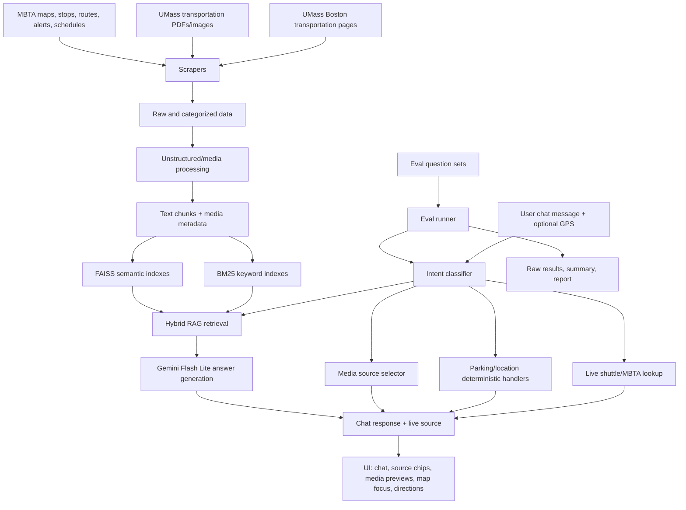

# EZRide UMass Boston Transportation Assistant

## Why We Built It And Its Purpose

UMass Boston transportation questions are not one simple lookup. A student may ask when the campus shuttle is coming, where to park, how much a specific lot costs, whether a Red Line outage changes the route to campus, or ask for an official PDF map. Those questions depend on several different kinds of information:

- Static university policy pages for parking, MBTA passes, shuttle hours, biking, EV charging, and transportation contacts.
- Official PDFs and images such as campus maps, MBTA subway maps, ferry maps, commuter rail maps, and bike maps.
- Live arrival data for UMass shuttle stops and MBTA stops.
- Map and routing context so "closest parking" and "get directions" behave like real location-aware tools.
- Safety rules so the assistant does not leak secrets, invent unsupported claims, or show maps/PDFs when the user only asked a timing question.

EZRide was built to bring those pieces into one campus transportation assistant. Its purpose is to answer UMass Boston transportation questions accurately, choose the right tool for the request, and keep the response useful inside the app: chat answers, map focus, source links, PDFs/images, live arrivals, or directions depending on the user's intent.

## Application Features

- **Transportation chatbot:** Answers questions about parking rates, permits, fines, towing, MBTA passes, shuttle hours, shuttle stops, biking, EV charging, accessibility, and transportation office contacts.
- **Live UMass shuttle arrivals:** Detects live-arrival intent and checks campus shuttle predictions for stops such as JFK/UMass, Campus Center, Bayside, JFK Library/Commonwealth Museum, Mt. Vernon, and University Drive West.
- **Live MBTA arrivals:** Handles Red Line, Green Line, Orange Line, commuter rail/Purple, Route 8, Route 16, and nearby stop prediction questions when a stop or location is available.
- **Intent-aware responses:** Separates retrieval questions from live-routing questions, so schedule/policy questions like "weekday shuttle hours" do not trigger live arrival lookup.
- **Parking clarification:** Broad parking-price questions ask which lot the user means, while specific lots, evening/weekend rates, permits, fines, and semester costs go to retrieval.
- **Closest parking support:** Uses the user's location when available and asks for location/start point when it is missing.
- **Map and directions tools:** Lets users choose a destination from categories such as parking lots, buildings, bus stops, and train stations, or enter a destination manually.
- **Media-aware RAG:** Returns official map files only when appropriate, including campus map PDFs/images and MBTA subway, system, downtown, frequent bus, ferry, commuter rail, and zone maps.
- **Disruption fallback advice:** Gives general replacement-shuttle and alternate-route guidance for MBTA outages/detours, including avoiding long walking routes when train service is replaced.
- **Secure deployment posture:** Uses environment variables for API keys, rate limits API routes, validates media paths, avoids coauthor metadata in commits, and includes tests for secret-leak prompts.

## Pipeline



## Why The Pipeline Is Designed This Way

The app uses a hybrid pipeline because transportation questions have different failure modes.

**Scraping and local processing** give the assistant stable university and MBTA context. This matters because official pages, PDFs, maps, and JSON route data contain facts the model should cite rather than guess.

**Unstructured/media processing** turns PDFs, images, and JSON route assets into structured chunks and metadata. This lets the chatbot retrieve both text facts and source files, so a request for a map can return a real PDF/image instead of a generic explanation.

**Hybrid retrieval with BM25 and semantic search** balances exact facts and natural phrasing. BM25 is strong for exact strings like `TransDM@umb.edu`, `$15`, `Route 16`, or `Visa`; semantic search helps when users ask in casual language.

**Intent classification before retrieval** prevents the biggest user-facing mistakes. Live arrival questions should call live APIs; policy questions should search documents; map-file requests should return media; parking-near-me questions should use GPS. Routing everything through one generic RAG call caused wrong behavior such as treating ferry paths as walkways, asking for a parking lot when the answer was an evening rate, or showing maps when the user asked shuttle timing.

**Deterministic handlers** are used for high-risk interaction boundaries: parking clarification, nearby parking, live transit follow-up prompts, media selection, disruption fallback, and underspecified pronouns like "how much does that cost?" These handlers keep the assistant predictable before the LLM writes the final answer.

**The LLM is constrained to retrieved context** for factual answers. It generates concise responses from the selected chunks and live context, while source chips and media attachments are produced by app logic.

## Overall Execution And Design

At runtime, the Flask server serves the app UI and exposes chat, routing, media, MBTA predictions, MBTA alerts, and shuttle arrival endpoints. The browser UI sends the user's message, conversation history, and optional location to `/api/chat`.

The server then:

1. Checks deterministic intents such as broad parking pricing, nearby parking, disruption routing, live shuttle arrivals, live MBTA arrivals, explicit media requests, and underspecified follow-ups.
2. Uses live APIs when the user asks for current arrivals.
3. Uses local parking and map metadata when the answer can be produced deterministically.
4. Routes retrieval to the best index category when a RAG answer is needed.
5. Streams the answer back to the UI with source chips, media files, or map focus events.

The frontend turns those events into the user experience: streamed chat text, source links, PDF/image thumbnails, map focusing, destination selection, and directions.

## Evaluation Of The Whole Application

The evaluation suite is built around realistic campus transportation questions rather than generic chatbot prompts. It includes live shuttle arrivals, live MBTA arrivals, parking clarification, parking rates, nearby parking, media/PDF requests, routing, MBTA disruption fallback, RAG facts, policy questions, contact questions, accessibility questions, off-topic questions, clarification questions, and secret-safety prompts.

Recent verification:

- Original fixed failure set: **9/9 passed**
- Additional remaining fixed cases: **2/2 passed**
- Final clarification regression: **1/1 passed**
- Final 100-question overall eval: **100/100 passed**

Saved eval artifacts include raw model/app responses, summaries, and Markdown reports under `eval/`, including:

- `eval/chatbot_eval_final_100_overall_verify_summary.json`
- `eval/chatbot_eval_final_100_overall_verify_report.md`
- `eval/chatbot_eval_fixed_original_9_verify_summary.json`

The eval runner also checks source behavior, media behavior, map-focus behavior, and expected answer content. This is important because a transportation assistant can produce a plausible sentence while still choosing the wrong mode, such as returning a map for an arrival question or doing retrieval for a live shuttle question.

## Running Locally

```bash
pip install -r requirements.txt
python3 server.py
```

Then open `http://localhost:8080`.

Required environment variables depend on which live features are enabled:

- `GOOGLE_API_KEY` for Gemini answer generation.
- `TRANSLOC_API_KEY` for UMass shuttle arrivals.
- `STADIA_API_KEY` for walking/directions routing.
- Optional CORS settings through `CORS_ORIGINS`.

## Testing

```bash
PYTHONPYCACHEPREFIX=/tmp/codex_pycache python3 -m unittest \
  tests.test_transit_live \
  tests.test_parking_intents \
  tests.test_server_intents
```

Run the final eval:

```bash
python3 eval/run_chatbot_eval.py \
  --questions eval/questions_final_100.json \
  --out-prefix chatbot_eval_final_100_overall_verify
```
